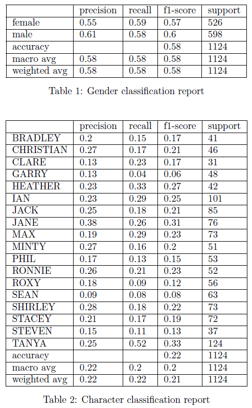
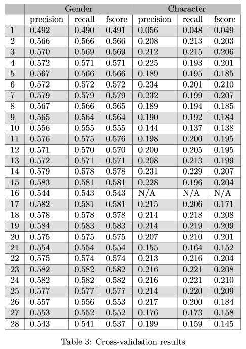

Abstract
========

Using labelled script lines from the show EastEnders, a classifier was
trained in Python to predict two labels; gender and character name. The
classifier was tested with the addition of a number of different
features, including word stemming, stop word removal, lemmatization,
Part-of-Speech (POS) tagging and using N-Gram language models. The
performance of including these features and techniques is evaluated. The
performance of different classifiers in this classification task are
also evaluated and discussed.

Classifier Training and Testing Setup
=====================================

In order to tune the performance of our model before final testing on
the unseen test data, a 10 fold cross-validation setup on the training
data was implemented. With a small training set, this has the key
benefit of training and testing across the full range of training data,
averaging the results of each test/train fold to give us improved
validity and reliability over a single training/holdout split. The
cross-validation results were used to find the best features,
classifiers and classifier parameters before ultimately training on the
entire training data set and testing on the unseen test data.

Please see the README document and code comments for more detailed
instructions on how to run the IPython notebook and associated code.

Pre-Processing The Data
=======================

Before undertaking the classification task, the data set provided needed
to be cleaned and processed. Looking at the raw CSV data in the
training.csv and test.csv files, there are a number of issues and
encoding errors to be resolved. An example of this is line 590 from the
training data -

``I hope you ain’t blaming me here...‚cause if``

Punctuation was also removed to enable discrete tokens when splitting by
white space, although this was saved before removing in order to be
subsequently added back in as a feature. The majority of this initial
pre-processing was completed with regular expressions. The number of
pauses were counted, denoted in the data by ``...``, and regexp was
used to distinguish this from full stops, i.e. a pause should not be
counted as 3 full stops. Regexp was also used to limit the character set
to a-z, A-Z, and 0-9 and then converting all text to lowercase and split
by whitespace into tokens. The entire dataset was processed in this way,
outputting to a file to manually check this process was working as
expected.

Baseline Performance
====================

In order to test baseline performance, randomly predicted labels for
both gender and character on the test data were made. On gender, an
f-score of 0.490 was obtained, and for character 0.0494. As gender is
binary, any correct prediction percentage of more 50% is performing
better than chance, and for character anything better than 100/18=5.5%.

The initial classifier used was LinearSVC, a support vector classifier
from the sklearn package. Baseline performance of this was tested by
splitting the training data only by white space and not implementing any
of the pre-processing above. This resulted in a total count of 12,120
features and obtained f-scores of (0.539, 0.164). By basic
pre-processing such as converting the lowercase, removing punctuation
and encoding errors above this was improved to (0.566, 0.203) with total
features reduced to 5746. Adding a simple count for each feature, this
further improved this somewhat to (0.569, 0.206).

These baselines were used when assessing the additional features added
below.

Basic Features
==============

The key basic features included were the individual words and their
count. Further testing was completed on adding punctuation features,
such as the number of commas, full stops and pauses. As can be seen in
the performance tables in the appendix, adding punctuation features only
marginally improved classifier performance for gender (0.571, 0.201).
Using the NLTK package, word stemming was assessed (0.572, 0.210), stop
word removal included (0.566, 0.185), and both stemming and stop removal
was implemented (0.579, 0.207). With stop word removal, a feature was
also implemented with a count of how many stop words were removed, with
the hypothesis some characters may use more stop words than others. This
actually significantly reduced performance (0.565, 0.185). A further
feature tested was including the sentence length as a raw count, with
similar detriment (0.564, 0.184). Another fairly basic feature attempted
was including simple bigrams as features. This made the total feature
count 39,793 with poor f-score performance (0.555, 0.138).

Testing Different Classifiers
=============================

The basic features that produced the best results were identified as
punctuation counts, word stemming with NLTK and stop word removal. Using
these features various classifiers were tested to attempt to improve
performance. Nearly all the parameters of the LinearSVC were tested,
with best results (0.578, 0.207) with C=0.05, max\_iter=10000,
loss=‘squared\_hinge’. The NuSVC got 0.543 on gender, however this was
unable to be used to predict characters. Better performance was observed
with Naive Bayes classifiers over Support Vector classifiers. The Naive
Bayes classifiers were chosen were those that work well with discrete
feature counts, ruling out classifiers such as BernoulliNB that work on
binary features. MultinomialNB performed well for gender but severely
underperformed on characters (0.581, 0.171). ComplementNB offered the
best performance after tuning the parameters with (0.583. 0.209) so this
was selected going forward.

POS Tags
========

Different types of POS tags were added as features. In order to ensure
proper tagging, the taggers were run before any of the more advanced
pre-processing on the text was completed. CRFTagger from nltk.tag was
imported and used with a pre-trained tagger. The total count of each tag
was included as a feature e.g. (’VBZ’: 1, ’NNP’: 3). Performance of this
was not improved (0.579, 0.208), possibly due to the amount of tags
included. Similar results were seen with pos\_tag from nltk, using the
Penn Treebank tagset which included 36 tags. By using the pos\_tag
parameter tagset=‘universal’, the tag set was reduced to 12. By using
the universal tags an improvement in performance (0.584. 0.210) was
seen. For future research, it would be interesting to see if further
reduction in tag set size would be an improvement, either combining tags
into one or simply removing some tags.

As it was observed that stemming was effective at improving classifier
performance, lemmatization using the POS tags was then tested. The
results of this were (0.577, 0.209) which did not represent an
improvement.

N-gram Language Models
======================

The most ambitious feature included was training N-gram language models
with Kneser-Ney smoothing. The Kneser-Ney technique was chosen due to
it’s excellent performance in language modelling tasks, despite the
additional complexity. By training separate language models on
exclusively male/female data, or on lines only from each character, a
general model was built of the types of language used by that
gender/character. The perplexity of a sentence given by each language
model was then included as a feature. Perplexity, as a measure of how
confused the model was by the test data, provides a measure of how
consistent the test data was with the text that trained that model. If a
character used a phrase often, this would be encoded within the model,
assuming a sufficiently high order (e.g. trigrams and above). Similarly
if males/females had general language patterns this would hopefully be
picked up by the language model and give us a clue to to the gender of
the speaker.

This presented significant implementation and programming challenges.
Particularly it was essential to ensure that when getting the perplexity
of a sentence, the language model had not been trained on that
particular sentence. In order to achieve this a cross-validation style
method was implemented that split the data into 5 folds. The language
models were trained on $\frac{4}{5}$ of the data while adding perplexity
features for the remaining $\frac{1}{5}$. This process was repeated 5
times on each fold to tag the entire training data correctly. For the
final test data the language models were trained on the entire training
data set, then adding the perplexity tags to the test data. Training 18
language models for each character also presented a challenge, although
this was eventually refactored into around 8 lines of code.

In order to tune the parameters (order, discount) of the Kneser-Ney
smoothing a simple 80% training, 20% hold out split was implemented for
fast iteration. The best parameters were found to be order of 5 (a
5-gram model) and a discount of 0.9, producing the lowest perplexity on
the heldout data for gender. A full table of this information is
available in the IPython notebook. These parameters were then passed to
our cross-validation method as described above.

Performance including these perplexity features was very poor when
included with our optimal parameters from previous testing. Including
both gender features e.g. (‘male’: 81, ‘female’: 99) achieved (0.553,
0.184) in cross-validation, and for characters e.g. (‘MAX’: 33) (0.552,
0.158). Including both was worse - (0.537, 0.145). To explain this, it
can be posited there may be very small differences in the general
language used by males/females overall, so there was not much relevant
information to be gained from this. It was expected to see more common
language from individuals, but likely the reality is individuals employ
a wide range of language, much of which is similar to other individuals.
It is also likely that by splitting an already quite small data set
overall into smaller parts, our language models simply did not get
enough data to be effective. It the future, attempting to reduce the
character features into 2 or 3 predictors could be beneficial, i.e. only
including the lowest 3 perplexities as features.

General Evaluation
==================

It is likely that there is only a weak correlation between gender and
the language used. This is reflected in the highest f-score of \~0.584.
There is however some correlation as performance is reliably some 8%
better than chance. By seeing the increase in f-score from baseline, it
seems the features encoded do encode some true correlation/information
within the text. For character identification the classifier performed
significantly better than chance - around 0.21 at the top end. The raw
chance baseline for this was \~0.05 and so a 400% better than chance
improvement was seen. This clearly suggests there is a much stronger
correlation between individuals and the language used, or more
accurately in this case, between characters in the show and the the
lines written for them by writers.

One general weakness of this classification was thought to be the
relatively small size of the data set. Clearly with more data one would
expect to see improved performance in this regard.

It was found in general that there is a sweet spot of the number of
features included. Generally reducing the amount of features overall and
not having too many features per sentence was better. This is because
too many irrelevant features will likely confuse the classifiers as they
try to take into account many features. In particular this was seen with
adding the character perplexity from language models. As this perplexity
information did not particularly seem that accurate in predicting the
speaker, this clouded the connections the classifier was able to make.

An interesting potential further research area would be to test chat
data, where lines are denoted by username. IRC chat logs would be a
particularly useful source as these are publicly available, in clear
text (not encrypted) and are easily logged. In addition each line is
written by a true individual, rather than a professional writer as in
this task. nltk\_data does contain some IRC chat logs such as this,
although many tens of thousands lines can be logged manually. The code
in this project can easily be modified for such a task.

Error Analysis
==============

See table 1 and table 2 on the next page for classification reports
based on the best results obtained. It can be seen in the gender report
that male lines were predicted slightly better than female, although not
significantly so. The character classification report is more
interesting. The f-score for Garry and Sean were very poor - only 0.06
and 0.08 respectively. The best performing characters were Jane with
0.31 and Tanya with 0.33. Looking into the line count per character,
Garry had 340 and Sean 520. Tanya had the most lines with 1276 and Jane
had 675. There were characters with higher lines than Jane that
performed worse, and characters with less lines that Garry than
performed better, so this is not the only factor. However it is clear
that the more lines that are available, the better the predictive power.
Looking at Garry’s lines it can be seen that there is also a large
number of single word responses and shorter lines, so in addition to
having fewer lines to begin with, they are less rich textually.

Final Performance
=================

Example feature vector:

``‘wed’: 1, ‘well’: 1, ‘caus’: 1, ‘shirley’: 3, ‘go’: 1,
‘bridesmaid’: 1, \`\`’": 1, ‘,’: 1, ‘!’: 1, ‘...’: 2, ‘PRON’: 4, ‘ADV’:
1, ‘DET’: 1, ‘NOUN’: 6, ‘VERB’: 4, ‘ADJ’: 1, ‘PRT’: 1, ‘CONJ’: 1``

Punctuation encoded, stemming, stop word removal, universal POS tags.

Cross-validation results - key

1. Random baseline
2. Basic pre-processing
3. Basic pre-processing with counts
4. Text to lowercase, removal of unwanted characters/encoding errors,
count of pauses (“…”) and punctuation features included (e.g. question
marks ‘?’ and apostrophes)
5. As above but removing stop words with NLTK
6. As above but stemming words with NLTK
7. Removing stop words with NLTK and stemming words with NLTK
8. With stopRemoved count i.e. how many stop words does a character use
9. With sentenceLength include as a feature – total number of words in
the sentence before we removed stops etc
10. Using bigrams with Linear SVC
11. LinearSVC classifier options loss=hinge
12. LinearSVC classifier options dual=False
13. LinearSVC classifier options penalty=l1, dual=False
14. LinearSVC classifier options C=0.05, max\_iter=10000,
loss=squared\_hinge
15. LinearSVC classifier C=0.05, max\_iter=10000, loss=squared\_hinge,
class\_weight=balanced
16. Using NuSVC with default options
17. MultinomialNB (Naive Bayes) with alpha=1.0, fit\_prior=False,
class\_prior=None
18. ComplementNB (Naive Bayes) with alpha=1.0, class\_prior=None,
fit\_prior=True, norm=False
19. ComplementNB (Naive Bayes) with alpha=1.0, class\_prior=None,
fit\_prior=True, norm=False
20. ComplementNB (Naive Bayes)with alpha=1.0, class\_prior=None,
fit\_prior=True, norm=False
21. ComplementNB (Naive Bayes) with default options and bigrams\
22. CRF tags with NLTK CRF Tagger
23. pos\_tag from NLTK - Penn Treebank tagset
24. pos\_tag(tokens, tagset=universal)
25. NLTK WordNet lemmatization instead of stemming
26. Gender language model
27. Character language model
28. Character and Gender language models

